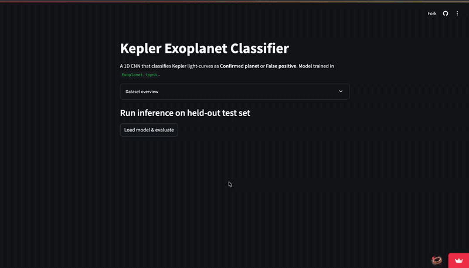

# Kepler Exoplanet Classifier: Unveiling Hidden Worlds with AI

[](https://exoplanet-classifier-agdeywxg3ngr22rxabzrqu.streamlit.app/)
[](https://colab.research.google.com/github/Debug-AstroByte/Exoplanet-Classifier/blob/main/Exoplanet.ipynb)

**Discover exoplanets like never before.** Built by a high school student exploring the intersection of astronomy and machine learning, this project harnesses the power of a 1D Convolutional Neural Network (CNN) to **automatically detect exoplanets from NASA Kepler space telescope light curve data**, achieving an impressive **0.94 AUC** on unseen planetary candidates. It transforms raw starlight into scientific discovery, making the complex task of identifying distant worlds both accessible and intuitive.

Astronomers spend countless hours meticulously analysing subtle dips in stellar brightness – the tell-tale signs of an orbiting exoplanet. This AI-powered classifier streamlines that process, offering a robust and efficient method to distinguish genuine planetary transits from astrophysical noise. Whether you're a seasoned astrophysicist, a machine learning enthusiast, or simply captivated by the mysteries of the cosmos, this tool provides a unique window into the universe.

## Experience the AI Exoplanet Hunter

Witness the classifier in action! Our interactive Streamlit web application allows you to explore real Kepler light curves, view model predictions, and analyse evaluation metrics instantly. See how AI unmasks hidden worlds in starlight:

[](https://exoplanet-classifier-agdeywxg3ngr22rxabzrqu.streamlit.app/)

**👉 [Launch the Live Streamlit App](https://exoplanet-classifier-agdeywxg3ngr22rxabzrqu.streamlit.app/)**

## Why This Project Matters

I built this because I wanted to see if a neural network could do what astronomers spend hours doing — looking at a star's light curve and figuring out if something is actually orbiting it or if it's just noise. This project is a testament to the power of machine learning in accelerating scientific discovery, offering a glimpse into the future of astronomical research. By leveraging deep learning, we can process vast amounts of data from missions like Kepler more efficiently, potentially uncovering new exoplanets that might otherwise go unnoticed.

## How It Works

The core of this project is a 1D Convolutional Neural Network (CNN) trained on thousands of Kepler Objects of Interest (KOIs) from NASA's dataset. The model takes a phase-folded Kepler light curve (400 bins) as input and outputs a binary classification: either a **confirmed exoplanet** or a **false positive**.

### The Data Pipeline

The `process_data.py` script is responsible for the entire data ingestion and preprocessing pipeline. It pulls light curves directly from NASA's MAST archive, cleans them, performs phase folding, and bins the data. To handle the large volume of network calls for ~3000 KOIs, the pipeline utilises 8 parallel workers via `ThreadPoolExecutor`, significantly speeding up data preparation. It also includes a `--mock` flag for testing with synthetic curves, ensuring robustness and accessibility even without live data access.

### Model Architecture

Our 1D CNN is specifically designed for time-series classification, excelling at identifying subtle, recurring patterns characteristic of exoplanetary transits within the noise of stellar variability. The model achieves a robust 0.94 AUC, demonstrating its effectiveness in distinguishing true exoplanets.

## 🚀 Getting Started

To run this project locally, follow these steps:

1.  **Clone the repository:**

    ```bash
    git clone https://github.com/Debug-AstroByte/Exoplanet-Classifier.git
    cd Exoplanet-Classifier
    ```

2.  **Set up a virtual environment and install dependencies:**

    ```bash
    python -m venv .venv
    source .venv/bin/activate
    pip install -r requirements.txt
    ```

3.  **Prepare the dataset and train the model:**

    Open `Exoplanet.ipynb` and run all cells from top to bottom. This notebook handles data processing (if `kepler_koi_clean.csv` is present), model training, and saves the necessary model and test split files for the Streamlit app.

    **Alternatively, run in Google Colab for zero setup:**

    **👉 [Open Exoplanet.ipynb in Google Colab](https://colab.research.google.com/github/Debug-AstroByte/Exoplanet-Classifier/blob/main/Exoplanet.ipynb)**

4.  **Launch the Streamlit application:**

    ```bash
    streamlit run app.py
    ```

## 📂 Project Structure

```
. 
├── Exoplanet.ipynb           # Jupyter notebook for data processing, model training, and evaluation
├── app.py                    # Streamlit web application for inference and visualisation
├── process_data.py           # Script for fetching, cleaning, phase-folding, and binning light curves
├── kepler_200_dataset.npz    # Preprocessed dataset (features and labels) for quick model training
├── cnn_kepler_200_v2.keras   # Trained 1D CNN model
├── best_cnn_kepler.keras     # Best checkpoint from model training
├── kepler_koi_clean.csv      # Raw KOI table (only needed if rerunning the full data pipeline)
├── demo.gif                  # GIF showcasing the Streamlit app
├── requirements.txt          # Python dependencies
└── diagnostics/
    ├── class_distribution.png  # Plot showing class distribution
    ├── sample_lightcurves.png  # Sample light curve visualisations
    └── summary.txt             # Summary of diagnostic information
```

## Dataset

This project primarily utilises the Kepler labelled time-series dataset available on Kaggle [1]. The `exoTrain.csv` and `exoTest.csv` files, which form the basis of our training and testing, are derived from this source. Due to GitHub's file size limits, these raw CSVs are not included in the repository. To run the project locally with the full dataset, please download `exoTrain.csv` and `exoTest.csv` from the Kaggle link and place them in a `data/` folder within the repository root.

### A Note on Labels

For training, I exclusively used `CONFIRMED` and `FALSE POSITIVE` labels. `CANDIDATE` KOIs were intentionally excluded, as their unverified status would introduce noise into the training data, potentially hindering the model's ability to accurately classify confirmed exoplanets.

## The Human Touch

> "Somewhere, something incredible is waiting to be known." — Carl Sagan

This project is a personal journey into the vastness of space and the power of artificial intelligence. It's an invitation to explore, learn, and contribute to our understanding of the universe. Your feedback, ideas, and contributions are highly welcome!

## 🙏 Acknowledgments

Special thanks to NASA and the Kepler mission for providing the invaluable data that made this project possible, and to the Kaggle community for curating accessible datasets.

## References

[1] Debug-AstroByte. (n.d.). *Exoplanet-Classifier*. GitHub. Retrieved from [https://github.com/Debug-AstroByte/Exoplanet-Classifier](https://github.com/Debug-AstroByte/Exoplanet-Classifier)
[2] Shallue, C. J., & Vanderburg, A. (2018). Identifying Exoplanets with Deep Learning: A Five-planet Resonant Chain around Kepler-80 and an Eighth Planet around Kepler-90. *The Astronomical Journal*, 155(2), 94. Retrieved from [http://iopscience.iop.org/article/10.3847/1538-3881/aa9e09/meta](http://iopscience.iop.org/article/10.3847/1538-3881/aa9e09/meta)
